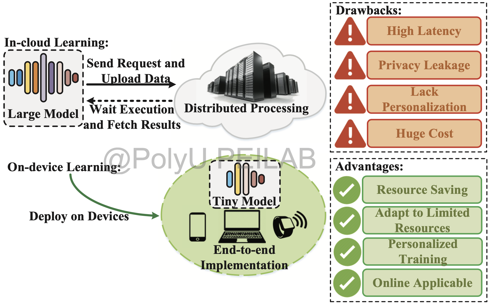
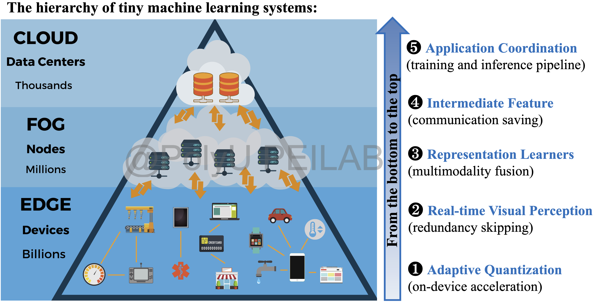
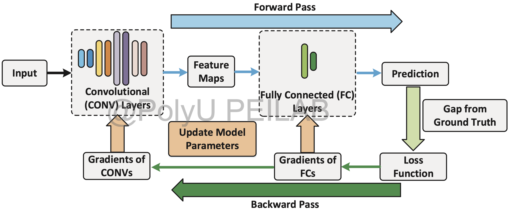
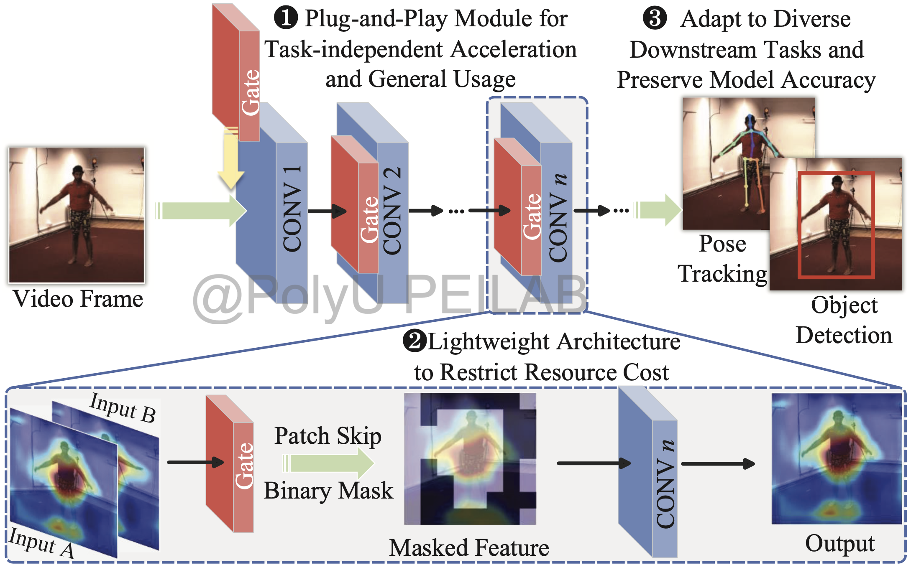
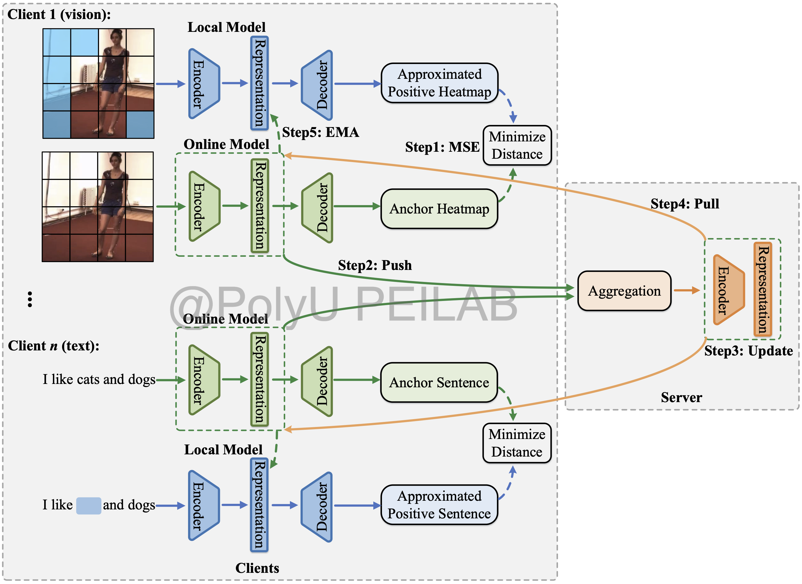
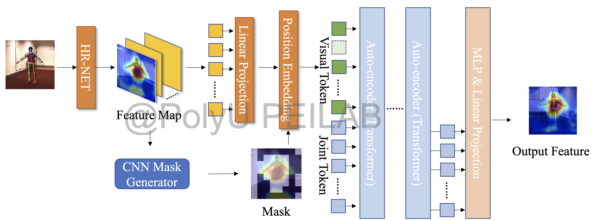

## 1. Introduction

Modern machine learning (ML) applications are often deployed in the cloud environment to exploit the computational power of clusters. However, this in-cloud computing scheme cannot satisfy the demands of emerging edge intelligence scenarios, including providing personalized models, protecting user privacy, adapting to real-time tasks and saving resource costs. To conquer the limitations of conventional in-cloud computing, it comes the rise of on-device learning, which handles the end-to-end ML procedure mainly on user devices, and restricts unnecessary involvement of the cloud. Despite the promising advantages of on-device learning, implementing a high-performance on-device learning system still faces many severe challenges, such as insufficient user training data, backward propagation blocking and limited peak processing speed.



**Illustration:** Conventional ML applications rely on the in-cloud learning paradigm, incurring essential drawbacks. Upgrading to the TinyML paradigm can effectively address these issues.

## 2. Architecture Overview
Observing the substantial improvement space in the implementation and acceleration of on-device learning systems, our group devote to designing high-performance TinyML architectures and relevant optimization algorithms, especially for embedded devices and microprocessors. Our research focuses on the software and hardware synergy of on-device learning techniques, covering the scope of model-level neural network design, algorithm-level training optimization and hardware-level instruction acceleration. Here, we present the architecture overview of our system design. 



**Illustration:** an efficient TinyML system require a holistic design of the entire hierarchy, which can be resolved as five key research opportunities.

##	3. Research Opportunities
Here are five key research opportunities to implement our system.

### Opportunity 1: Adaptive Quantization-aware Training and Model Compression



**Illustration:** On-device learning is an emerging technique to pave the last mile of enabling edge intelligence, which eliminates the limitations of conventional in-cloud computing where dozens of computational capacities and memories are needed. A high- performance on-device learning system requires breaking the constraints of limited resources and alleviating computational overhead. Our preliminary work shows that employing the 8-bit fixed-point (INT8) quantization in both forward and back- ward passes over a deep model is a promising way to enable tiny on-device learning in practice. The key to an efficient quantization-aware training (QAT) method is to exploit the hardware- level enabled acceleration while preserving the training quality in each layer. However, off-the-shelf quantization methods cannot handle the on-device learning paradigm of fixed-point processing. To overcome these challenges, we propose to design an adaptive QAT algorithm, which jointly optimizes the computation of forward and backward passes. Besides, we need to build efficient network components to automatically counteract the quantization error of tensor arithmetic. We intend to implement our methods in Octo, a lightweight cross-platform system for tiny on-device learning, and keep improving its performance to support more realistic applications.

### Opportunity 2: Task-independent Patch Skip for Real-time Visual Perception



**Illustration:** exploiting temporal redundancy in video streams is a promising way to implement efficient on-device video perception systems. We abstract away the computation saving problem from video perception tasks and propose a task-independent acceleration methodology that can generalize to different runtime environments. Following this principle, we intend to develop new quality-determining factors for system design and present an automatic computation skipping method to support diverse video perception settings by decoupling acceleration and tasks. We intend to equip each convolution layer with a learnable gate to selectively determine which patches could be safely skipped without compromising model accuracy. The gate is optimized via a tough self-supervisory procedure and holistically learns high-level semantics to distinguish similarity and difference across frames. The tiny architecture of the gate is compatible with commodity edge devices and can serve as a plug-and-play module in CNN backbones to enable patch-skippable networks. 

### Opportunity 3: A Unified Contrastive Representation Learner for Cross-modal Federated Learning Systems



**Illustration:** Contrastive representation learners have achieved great advantages for modern visual tasks. Existing methods (e.g., CLIP, visialGPT, VideoCLIP, and UniFormer) are resource-expensive, thus are not suitable for the realistic scenarios of deploying federated learning applications. Meanwhile, the single data modality of conventional FL systems significantly limits the scalability and applicability. Building an economical and efficient representation learner is the key issue to implement downstream tasks. This requires us to design a new cross-modal federated learning framework, which tackles the multimodality fusion of latent features and provides higher performance over the single-modal paradigms.

### Opportunity 4: Progressive Network Sparsification and Latent Feature Compression for Scalable Collaborative Learning



**Illustration:** In the edge intelligence environment, new data is continuously generated on user devices that cannot be aggregated at once due to privacy and energy concerns. These issues require us to develop new insights into traffic saving to build a communication-efficient collaborative learning paradigm. Unlike previous methods aiming at improving bandwidth utilization or using an unstructured pixel-wise compression, we jointly capture the channel and spatial-level feature redundancy, and conduct a hierarchical compression in these two levels to achieve a much higher traffic reduction ratio. Specifically, we need to design a more efficient feature compression method to leverage the pixel similarity, and reorganize the features into groups based on channel significance to prune the network. Meanwhile, we intend to calibrate the gradients of compressed features with a comprehensive theoretical analysis of the convergence rate. Such a co-design can provide a significant traffic reduction over existing methods while not sacrificing much model accuracy, achieving good training flexibility and communicational efficiency. We believe this work can contribute to the further development of edge intelligence applications.

### Opportunity 5: Masked Autoencoders for Occlusion-aware Visual Learners



**Illustration:** Recent years have witnessed learning-based video perception algorithms getting popular in more scenarios with occlusions, where invisible areas for perception objects significantly affect accuracy. Existing methods mainly use convolutional neural networks as the backbone and get limited local features to recover the occluded part. Such an anti-occlusion pipeline often suffers from the challenges of self-occlusion scenery, where similar parts of occluders and occludes are ambiguous. In this case, we need to design a masked visual autoencoder for image processing and video streaming, which recovers occluded regions by extracting deep spatial information at a higher semantic level. This autoencoder can get better details inferred from global self-attention and thus improves accuracy. The gist is to train the autoencoder to extract key-point information from the key patches that are manually masked in a self-supervised manner to simulate the occlusion in video streaming. To choose the patches that should be masked, we design a high-capacity learnable gate that can extract contrastive representation, i.e., distinguish important feature regions and background regions, to generate a binary mask by randomly choosing a part of feature patches. We also propose an end-to-end pipeline for training and inference, which can effectively reduce the dependency of annotated occluded datasets and can be further applied to other visual tasks. This pipeline can obtain a great computation saving with much fewer annotated datasets, and hold a higher runtime performance over the SOTA ViT methods.

## 4. Achievements
The on-device learning techniques can be employed in many emerging TinyML scenarios, where the system performance is often bounded by the limited hardware resources. Currently, our group has achieved breakthroughs in improving the computational capacity and designing domain-specific AI chips for task acceleration. These chips can be designed from the perspectives of model compression, few-shot learning, quantization-ware training, memory management and low-level instructions. We pursue the vision that helps researchers and developers optimize AI deployment without tedious code modifications. Some research demos have been open-source on Github, please visit at:
- [https://github.com/kimihe](https://github.com/kimihe)
- [https://github.com/FromSystem](https://github.com/FromSystem)

## 5. Related Publications
[1] Octo: INT8 Training with Loss-aware Compensation and Backward Quantization for Tiny On-device Learning, In Proc. of USENIX Annual Technical Conference (ATC), 2021 (CCF-A).
[2] On-device Learning Systems for Edge Intelligence: A Software and Hardware Synergy Perspective, IEEE Internet of Things Journal, 2020 (JCR-Q1).
[3] Petrel: Heterogeneity-aware Distributed Deep Learning via Hybrid Synchronization, IEEE Transactions on Parallel and Distributed Systems (TPDS), 2020 (CCF-A).
[4] Dual-view Attention Networks for Single Image Super-Resolution, In Proc. of the ACM International Conference on Multimedia (MM), 2020 (CCF-A).

## 6.	Cooperators
Our group have established close cooperation with industrial communities, including Microsoft Research Asia, Alibaba DAMO Academy, Huawei Cloud, etc.

## 7.	PhD/intern Applications:
We are looking for students and partners who are interested in:

(1) On-device/TinyML Systems (for Edge Intelligence)  
(2) Distributed Machine Learning Systems (for Data center)  
(3) Modern AI/ML frameworks: e.g., NVIDIA NCCL, CUDA, TensorRT, Apple CoreML, PyTorch, TensorFlow, Keras, BytePS, Gym, etc.  
(4) Domain-specific hardware optimization and implementation, e.g., NVIDIA Jetson, FPGA, Microprocessors, AI Chips, etc.  
(5) Coding contribution to our GitHub repositories.

